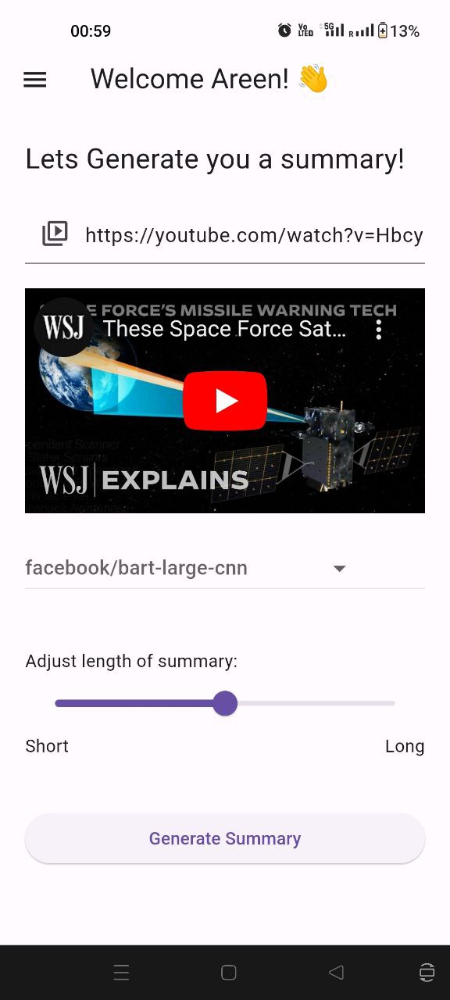
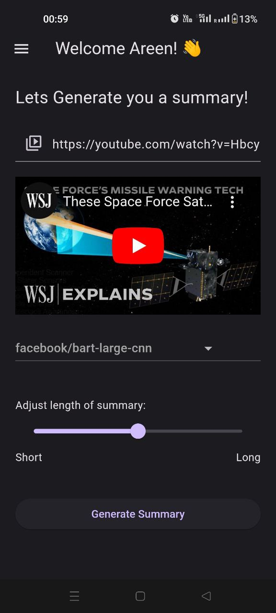
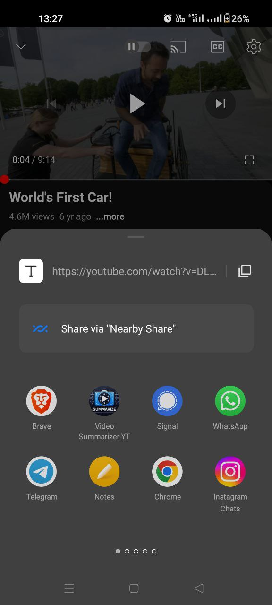
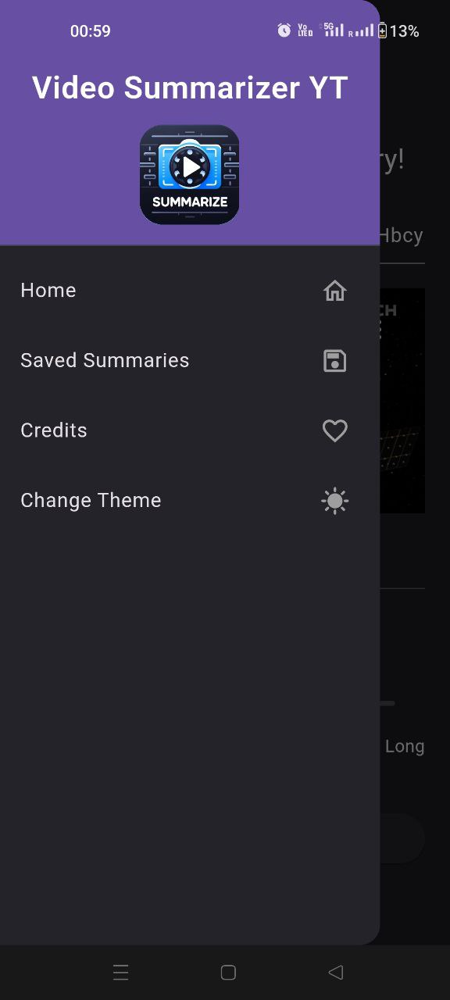
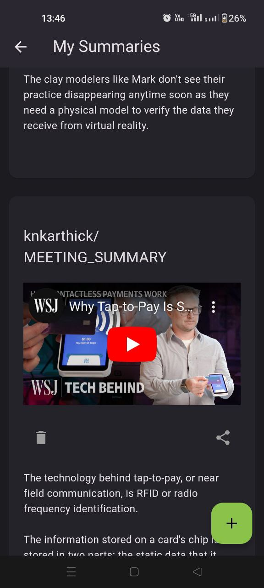

# video_summariser_yt

A YT Caption Summariser (Flutter App).

## Sample Images
<p align="center">
  
  
  
  
  
  
</p>

## Features

 - Generates summary when given a YT video URL.
 - Available in both light and dark mode.
 - Allows users to share YT links from other apps.
 - Users can select a model to generate the summary (All models are available on [Huggingface](https://huggingface.co/models?pipeline_tag=summarization)).
 - Generated summaries can be saved to local storage and shared with other apps.
 - Uses [captions-api-yt](https://github.com/04ac/captions-api-yt) to get the video captions.
 - Uses the [Huggingface API]("https://huggingface.co/docs/api-inference/en/index") to get generated summaries.

## Install, build and run!
To clone and run this application, you'll need [Git](https://git-scm.com) installed on your computer. From your command line:

```bash
# Clone this repository
$ git clone https://github.com/04ac/video-summarizer-yt

# Go into the repository
$ cd video-summarizer-yt
```

Download Android Studio or Visual Studio Code with Flutter editor plugins. After that, open the project and install dependencies from ```pubspec.yaml``` by running the following command:
```bash
$ flutter pub get
```


## Built With

This software was built using the following:

- [Flutter](https://flutter.dev/)
- [Dart](https://dart.dev/)
- [flutter_bloc](https://bloclibrary.dev/#/)
- [isar db](https://isar.dev/)
- [Android Studio](https://developer.android.com/studio)
